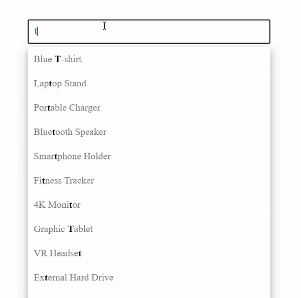

# Typeahead Search Box

This React application showcases the implementation of a typeahead search box.

## Preview



## Features

Following are the features that has been included in the search box.

1. **Debouncing -** Debouncing helps to limit the number of API calls made while typing in the search box. It ensures that the API is called only after the user has stopped typing for a specified delay.
2. **Cancellable Promise -** Promises are wrapped to provide a mechanism for cancellation. This feature is useful in scenarios where the result of a subsequent API call arrives before a previous one, allowing us to cancel the outdated request and avoid unnecessary processing.
3. **Search Query Highlighting -** The search query is highlighted in the search results, making it easier for users to see the relevance of each result.
4. **Caching -** The results of all API calls are cached to improve performance and reduce the number of network requests. If a query has been searched before, the cached result is returned instead of making a new API call.

Note - For simplicity, there is no real backend for this app. A Dummy Backend has been included in 'backend' directory.

## Installation

- Pull this branch into your local system.
- Make sure you have Node installed (preferrably Node v20.11.1).
- Navigate to the project directory and run
  ```
  npm install
  ```
- Once all the dependencies have been installed, run the following command to start the dev server.
  ```
  npm run dev
  ```
